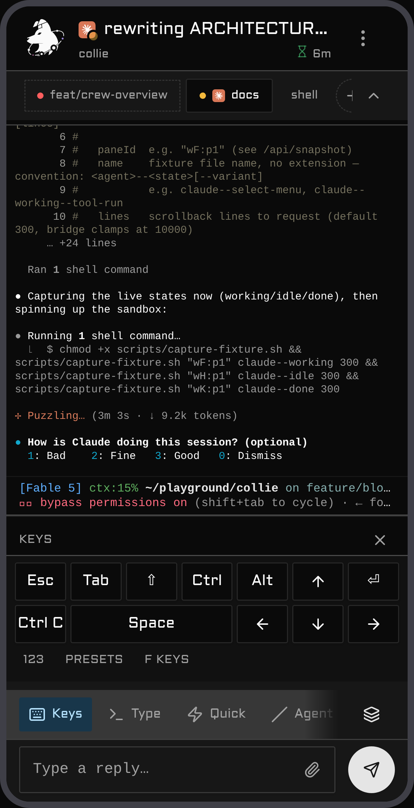

# Collie

<p align="center">
  
</p>

A phone web UI for your [Herdr](https://herdr.dev) agent herd, served over Tailscale. Open a URL, see
which agent is waiting on you, and answer it with your phone's keyboard.

The reply box is an ordinary text field, so your phone's own voice dictation works in it; Collie
ships none of its own.

**Features**

- **React Router + Vite** — TypeScript, Tailwind, shadcn, and a Bun bridge
- **A dashboard ranked by who needs you**, not by what changed last
- **Push notifications** the moment an agent is waiting on you
- **Quick actions and slash commands** per agent — tap, don't type
- **Special-keys pad** — `Esc`, `Ctrl+C`, arrows, combinable modifiers
- **Find in output**, and **conversation history** the terminal can't scroll back to
- **Send an image** from your camera roll
- **Switch between Herdr sessions** without touching the host
- **Installs to your home screen** (PWA) and runs entirely on your own machine — loopback bind, no
  cloud, no account

## Contents

- [Demo](#demo)
- [Motivation](#motivation) · [Who is this for](#who-is-this-for)
- [Security — read first](#%EF%B8%8F-security--read-before-you-run-it) ·
  [Pair a device](#pair-a-device--the-write-credential)
- [Requirements](#requirements)
- [Install](#install)
- [First run — what you'll see](#first-run--what-youll-see)
- [Configure](#configure) · [Your own slash commands](#your-own-slash-commands) ·
  [Multi-session](#multi-session)
- [Dark mode / light mode](#dark-mode--light-mode)
- [Commands](#commands) · [Put `collie` on your PATH](#put-collie-on-your-path) ·
  [Herdr actions](#herdr-actions)
- [Manage & update](#manage--update) · [Migrating from 0.x](#migrating-from-0x)
- [Deployment variants](#deployment-variants) · [B–E in `DEPLOYMENT.md`](./DEPLOYMENT.md)
- [Windows (experimental)](#windows-experimental)
- [Web Push](#web-push-optional)
- [Troubleshooting](#troubleshooting)
- [Architecture](#architecture)
- [Developing this plugin](#developing-this-plugin)

## Demo

A run through the herd from a phone: the dashboard floats the agent that **needs you** to the top,
you drill into a space's tabs and panes (long-press a pane pill or a tab chip to rename or close it —
and a Claude pane shows the name you gave it with `/rename`), answer an `AskUserQuestion` prompt with
a tap, switch between herds, and pick up a push notification the moment an agent is waiting on input.

<table>
  <tr>
    <td align="center" width="50%"><br><sub><b>Dashboard</b> — agents needing you float to the top</sub></td>
    <td align="center" width="50%"><br><sub><b>Ask</b> — Claude's own questions become tappable buttons</sub></td>
  </tr>
  <tr>
    <td align="center" width="50%"><br><sub><b>Space</b> — its tabs and panes, deep-linkable</sub></td>
    <td align="center" width="50%"><br><sub><b>Keys</b> — the special-keys pad, no chords to remember</sub></td>
  </tr>
  <tr>
    <td align="center" width="50%"><br><sub><b>Session switcher</b> — one collie, every herd</sub></td>
    <td align="center" width="50%"><br><sub><b>Settings</b> — notifications, DND, diagnostics</sub></td>
  </tr>
</table>

## Motivation

I wanted to check on my agents from my phone. The usual route is [Termux](https://termux.dev) — SSH
in, attach to the terminal — but driving a TUI through its on-screen controls is miserable: the
special keys are fiddly, `Ctrl`/`Esc`/arrows are buried behind chords, and every reply is a fight
with the keyboard. I wanted something that feels like an app, not a terminal squeezed onto a
touchscreen: tap the agent that needs you, type with your real keyboard, fire `Esc` or `Ctrl+C` with
one thumb. Collie is that.

## Who is this for

You, if you run [Herdr](https://herdr.dev) agents on a machine and want to pick a session back up
from your phone. It assumes a **[Tailscale](https://tailscale.com) tailnet**: your phone and the host
are on the same tailnet, and `tailscale serve` is the default way in. It is **single-user** — one
operator, one tailnet, no multi-tenant auth. If you need shared or public access, Collie isn't built
for it. Read the security note below either way.

## ⚠️ Security — read before you run it

**Collie is remote shell access to your machine, by design.** One Collie API call types arbitrary
keystrokes into a live terminal pane, so anyone who can reach the URL can read every pane (source,
secrets, env, agent output) and run any command as your user. No sandbox, no command allow-list
(that would defeat the purpose). Treat the URL like a root login.

The sharp edges:

- **It acts as _you_**, with your full privileges — `~/.ssh`, `git push --force`, `rm -rf`, `sudo`.
- **Access is device-level, not person-level.** Tailscale proves the device, not who's holding it —
  no password, no session, so an unlocked or stolen phone is an open shell. Pairing a device is the
  answer to that ([below](#pair-a-device--the-write-credential)); the idle lock is not — it pauses an
  unattended screen and gates nothing (details:
  [ADR 0007](./.adr/0007-the-idle-lock-is-a-pause-not-a-gate.md)).
- **Every uid on the host can reach it.** Herdr's socket is a file, so its permissions keep other
  local users out; Collie's port is TCP, so they're all in. Pairing or the per-device gate closes the
  write half of that; reads stay open, so it bounds damage, not disclosure (details:
  [ARCHITECTURE.md §6](./ARCHITECTURE.md#6-security-model)).
- **One collie fronts _every_ session** under your config root by default, sandbox ones included
  (details: [Multi-session](#multi-session)).
- **Every write is appended to `<state-dir>/audit.log`** — replies, keys, uploads, pane and tab
  create/close. A trail is not a gate (details:
  [ARCHITECTURE.md §6](./ARCHITECTURE.md#6-security-model)).
- **The defenses:** loopback bind only, never `0.0.0.0`; exactly one hardened front door —
  `tailscale serve` or a conforming reverse proxy, never `funnel` and never a bare port; a
  same-origin gate and a strict CSP, with pane output rendered as React text nodes rather than
  `innerHTML`. Two settings are yours to switch on, and you should: `COLLIE_TRUSTED_USER` rejects any
  tailnet login but yours, and `COLLIE_PUBLIC_HOSTS` blocks DNS rebinding (effectively mandatory
  under `COLLIE_SERVE_MODE=http`). Authorising individual *devices* is
  [pairing](#pair-a-device--the-write-credential) — no proxy required — or, if a proxy already
  injects a device identity, `COLLIE_DEVICE_HEADER` + `COLLIE_DEVICE_ALLOWLIST`, see
  [`DEPLOYMENT.md`](./DEPLOYMENT.md).

> 🚫 **Never `tailscale funnel` this** — funnel exposes it to the public internet; `serve` keeps it
> tailnet-only. There is no scenario where funneling Collie is correct.

Narrow the blast radius with Tailscale ACLs and `COLLIE_TRUSTED_USER`. Provided as-is, no warranty.

### Pair a device — the write credential

The two device gates answer different questions, and you can run either, both, or neither:

| | asks | trusts | revoke by |
| --- | --- | --- | --- |
| `COLLIE_DEVICE_HEADER` | *is this device on the operator's list?* | your proxy, to inject a name it sanitised | editing `COLLIE_DEVICE_ALLOWLIST`, then restarting |
| **pairing** | *does this device hold a credential I issued?* | nothing on the network | `collie devices revoke <label>` — live |

Pairing costs no infrastructure, so it is the one to reach for on a plain `tailscale serve` setup,
where there is no proxy to inject a header in the first place. Both are **write** gates: reads stay
open to anything that clears the same-origin gate either way.

```bash
bin/collie pair          # on the host — prints an 8-character code, good for 10 minutes
```

Open Collie on the phone → **Settings** → **Paired devices** → enter the code and a name for the
device. The phone stores the token it gets back; Collie stores only its hash, and the token is
shown exactly once. Nothing needs restarting — the running service picks up a pairing (and a
revocation) on the next request.

```bash
bin/collie devices list             # what holds a credential, and when each was last seen
bin/collie devices revoke old-phone # effective immediately, no restart
```

**Pairing the first device turns the requirement on for every device**, so pair the phone you are
holding first. Revoking the last one turns it back off — there is no state in which you are locked
out of your own collie. A wrong code is worth five attempts before the code is destroyed and you have
to run `collie pair` again.

## Requirements

On the **host** (the tailnet node your agents run on). Need Herdr 0.7.0+ — check with
`herdr --version`.

| Tool | Why |
| --- | --- |
| [**Bun**](https://bun.sh) | Runs the bridge and builds the web UI — the only hard dependency. |
| [**Herdr**](https://herdr.dev) ≥ 0.7.0 | The herd Collie mirrors; its CLI registers the plugin. |
| [**Tailscale**](https://tailscale.com) | Front door for the default variant (`tailscale serve`); optional if you run [Variant C](./DEPLOYMENT.md#variant-c--reverse-proxy-as-the-only-front-door-no-tailscale) behind your own reverse proxy. Without any front door, Collie is `127.0.0.1`-only. |
| **git** | Clone, and the `update` command. |

Soft dependencies: **Node.js** (the `collie` CLI uses it to extract your MagicDNS name from
`tailscale status --json`; without it the banner falls back to the loopback URL) and a **service
supervisor** — `systemd --user` on Linux, **launchd** on macOS (both ship with the OS); a host with
neither falls back to an unsupervised `nohup` process. You never install JS
deps by hand — the build runs `bun install` for you; the backend imports only Bun + `node:*`.
[`web-push`](https://www.npmjs.com/package/web-push) is optional and lazy (see [Web
Push](#web-push-optional)).

**Linux and macOS are the supported hosts.** The bridge itself also runs on **Windows**
(experimental) against Herdr's Windows beta — see [Windows](#windows-experimental).

## Install

On the host, not your phone. Two ways in.

**From GitHub (turnkey)** — Herdr fetches and builds for you:

```bash
herdr plugin install AltanS/collie
herdr plugin action invoke start --plugin herdr.collie
```

**From a local clone (for development)** — registered by path:

```bash
git clone https://github.com/AltanS/collie.git && cd collie
herdr plugin link "$(pwd)"
herdr plugin action invoke start --plugin herdr.collie
```

Either way, `start` does four things:

1. **builds** `web/dist` if it's missing (typechecked, staged, swapped in atomically),
2. **starts the bridge** as the `systemd --user` service `collie` (`nohup` fallback without systemd),
3. **publishes it on the tailnet** — literally `tailscale serve --bg 8787`: HTTPS on the host's
   MagicDNS name, `:443 → 127.0.0.1:8787`, tailnet-only,
4. **prints the banner** with the URL to open — walked through line by line in
   [First run](#first-run--what-youll-see).

> No Herdr? Run `scripts/collie-ctl.sh start` from the checkout — same effect (config then lives in
> `~/.config/collie/.env`). That first run compiles `bin/collie`, which is how you spell every
> command from then on — see [Commands](#commands).

## First run — what you'll see

The transcripts below are the CLI's inline output. **Through `invoke start` you get Herdr's JSON
envelope instead** — the same text is the action's *captured stdout*, read with
`herdr plugin log list --plugin herdr.collie`.

```console
$ bin/collie start
building web UI (first run)…                    # linked clone only; a GitHub install already built
…bun install · typecheck · vite build output…
bridge started (systemd --user: collie)
tailscale serve (https) → tailnet :443 -> 127.0.0.1:8787

  ✓ Collie is running  ·  v0.15.0+174c4e4
    service   systemd --user (collie) · active
    local     http://127.0.0.1:8787
    tailnet   https://myhost.tail1234.ts.net
```

The `✓` is a real probe — Collie connected to the bridge's port and got an answer, not just
"the unit is active". If you get `⚠ Collie isn't answering on :8787 yet` instead, see
[Troubleshooting](#troubleshooting).

### What just happened

`start` left three durable things on the host:

1. **`web/dist`** — the built UI, served from disk, so later rebuilds go live without a restart.
2. **A supervised user service** — a `systemd --user` unit named `collie`, or a launchd agent on
   macOS ([Surviving reboots](#surviving-reboots) has the details of both).
3. **A tailnet-only `tailscale serve` mapping** — HTTPS on the host's MagicDNS name,
   `:443 → 127.0.0.1:8787`, TLS terminated by Tailscale. Inspect with `tailscale serve status`;
   remove just this mapping with `bin/collie unserve`.

`stop` merely pauses the service; `uninstall` reverses 2 + 3 and keeps your `.env` and the checkout.
Why a service and not a Herdr pane: [`ARCHITECTURE.md`](./ARCHITECTURE.md) §3.

### Open it on your phone

The URL is the banner's `tailnet` line — print it again anytime with `bin/collie url`, or
`bin/collie qr` to print it as a QR code you can scan rather than type a MagicDNS name into a phone
keyboard. It resolves for any device on your tailnet, so the phone needs the Tailscale app installed
and connected to the same tailnet as the host.

Then install it as an app: **iOS** — Safari → share sheet → *Add to Home Screen*. **Android** —
Chrome → ⋮ menu → *Add to Home screen* (or *Install app*). Installing (and Web Push) needs the
HTTPS origin the default serve mode already provides; over `COLLIE_SERVE_MODE=http` the page works,
but service worker and install silently no-op.

### Is it actually working?

A sixty-second check, host side then phone side:

```console
$ bin/collie status

  ✓ Collie is running  ·  v0.15.0+174c4e4
    service   systemd --user (collie) · active
    local     http://127.0.0.1:8787
    tailnet   https://myhost.tail1234.ts.net

  serve config:
    https://myhost.tail1234.ts.net (tailnet only)
    |-- / proxy http://127.0.0.1:8787
```

```console
$ bin/collie logs        # journal timestamps trimmed here
[push] disabled (no VAPID keys configured)
[bridge] listening on http://127.0.0.1:8787  (poll 1500ms)
[bridge] WARNING: COLLIE_TRUSTED_USER is empty — any tailnet device/user that reaches the bridge gets full write access. Set it to your tailnet login (see README → Variant A).
[bridge] WARNING: COLLIE_PUBLIC_HOSTS is empty — Host-header validation is OFF (DNS rebinding not blocked). Set it to your MagicDNS name, especially under COLLIE_SERVE_MODE=http.
```

**Both WARNINGs are expected on a fresh install** — that's Collie telling you it's running
open-by-default on your tailnet. [Configure](#configure) closes both. (The loopback URL in the log
is also correct: Collie itself only ever binds `127.0.0.1` — `tailscale serve` is what makes it
reachable.) `[push] disabled` is expected too: notifications are opt-in, and
[Web Push](#web-push-optional) is three commands.

On the phone: your agents are listed, and the footer build stamp (`v0.9.0 · debcff9 · …`) matches
`bin/collie version`. If the page loads but stays empty, that's the same-origin gate — see
[Troubleshooting](#troubleshooting).

## Configure

Out of the box Collie runs **open single-user**: anyone on your tailnet who can reach the URL has
full control — that's exactly what the two startup WARNINGs are about. Close both in one sitting:

```bash
# in your .env
COLLIE_TRUSTED_USER=you@example.com           # your tailnet login — Collie rejects anyone else
COLLIE_PUBLIC_HOSTS=myhost.tail1234.ts.net    # exact host(s) you serve on — blocks DNS rebinding
```

Config is a `.env` in the plugin's config dir — find it with
`herdr plugin config-dir herdr.collie` (typically `~/.config/herdr/plugins/config/herdr.collie`;
without Herdr, `~/.config/collie`). The CLI resolves this same dir whether you run it directly or
via a Herdr action:

```bash
cp .env.example "$(herdr plugin config-dir herdr.collie)/.env"
```

Collie reads `.env` only at startup — after any edit, `bin/collie restart`. See
[`.env.example`](./.env.example) for the full option list — commonly `COLLIE_PORT`, or
`COLLIE_SERVE_MODE=http` (Headscale / `.internal` domains; read by the CLI when it runs
`tailscale serve`).

Reading history from more than one agent home? List them all in `COLLIE_TRANSCRIPT_ROOT`,
comma-separated.

**Custom domain or reverse proxy?** [`DEPLOYMENT.md`](./DEPLOYMENT.md) has the full front-door setup.
The one rule to know here: Collie is same-origin only, so a different hostname or TLS terminator
needs the exact origin allowed —

```bash
COLLIE_ALLOWED_ORIGINS=https://collie.example.com
```

— and until you do, the page loads and stays empty
([Troubleshooting](#troubleshooting) has the symptom).

### Your own slash commands

Commands only this machine has (a plugin's `/fork-in-herdr`, your own `/deploy`) go in
`commands.toml`:

```bash
cp commands.toml.example "$(herdr plugin config-dir herdr.collie)/commands.toml"
```

```toml
[[commands]]
scope = "omp"                # optional; omit for every pane
command = "/fork-in-herdr"
description = "Fork this conversation into a new herdr tab"
```

A pane your rows match shows only your rows (narrowest row wins,
[ADR 0018](./.adr/0018-operator-command-rows-replace-the-catalog.md)). Add `confirm = true` for a
two-tap confirm. No restart — edits are live. Verify: open a pane, tap **/**, your rows are on the
first screen. Syntax error? `journalctl --user -u collie -n 20` names the line.

### Your own key presets

The Keys tray's **Presets** row is yours to replace, in `keys.toml` next to `commands.toml`:

```bash
cp keys.toml.example "$(herdr plugin config-dir herdr.collie)/keys.toml"
```

```toml
[[keys]]
scope = "claude"             # optional; omit for every pane
label = "Yes"
keys = ["Down", "Enter"]     # several chords go out as one batch
```

A pane your rows match shows only your presets, in place of the shipped Ctrl C/D/U/R/L/Z
([ADR 0018](./.adr/0018-operator-command-rows-replace-the-catalog.md)). Add `danger = true` for a
two-tap confirm. The rest of the tray — Esc, arrows, Enter/Tab/Space, modifiers, digits, F1–F12 —
is fixed and not configurable. Chords are herdr's spelling: `ctrl+c` (never `C-c`), `shift+tab`,
`ctrl+F7`; `PageUp`/`Home`/`End`/`Delete` are not accepted. No restart — edits are live. Verify:
open a pane, tap **Keys → Presets**, your buttons are there. Rejected row?
`journalctl --user -u collie -n 20` names it and why.

### Multi-session

`COLLIE_MULTI_SESSION=on` (the default) discovers and serves every named Herdr session under your
config root, switchable from the header; `COLLIE_MULTI_SESSION=off` serves only the primary one. Every
session it finds is drivable through the same URL — including a private or sandbox one, which is why
[Security](#%EF%B8%8F-security--read-before-you-run-it) lists this as a sharp edge.

## Dark mode / light mode

**Collie follows your phone by default.** To pin it, open **Settings → Appearance** and pick
**System**, **Light** or **Dark**. The choice is **per device**, stored in the browser, not on the
bridge: your phone can sit on Dark while the laptop follows the OS. It survives reloads and
reinstalls of the PWA on the same device.

### The terminal mirror is deliberately different

The mirror always renders on a **dark ground**, and light mode inverts the whole thing rather than
re-colouring it. That is not a shortcut — agents emit absolute colours (`38;2;r;g;b`) chosen for a
black terminal, and nothing downstream can re-theme them; dropped straight onto white, most of an
agent's output falls below 3:1. Inverting keeps the contrast the agent designed for. The full
measurement is in [ADR 0002](./.adr/0002-invert-the-light-terminal-mirror.md).

Two things follow that are worth knowing:

- **Keep your agents on a dark theme** — the default for Claude Code, codex, opencode and pi. An
  agent set to a *light* theme emits dark-on-light colours, which are unreadable in Collie under
  either appearance. This is a property of what the agent sends, not of Collie's rendering.
- **Diffs and highlighted rows show as dark blocks** in light mode. Legibility is unaffected; only
  the visual weight flips.

> **Installed on iOS?** In light mode the status-bar text stays white and can disappear against the
> page. iOS gives web apps no way to change this at runtime — use the browser rather than the
> installed app if it bothers you.

## Commands

Every command works two ways: the **`collie` binary** in the checkout (`bin/collie <cmd>`) or the
equivalent **Herdr action** (`herdr plugin action invoke <cmd> --plugin herdr.collie`, written below
as `invoke <cmd>`). The ones you'll actually use:

| Action | `collie` CLI | Herdr action |
| --- | --- | --- |
| **Start** — build if needed, serve, print the URL | `collie start` | `invoke start` |
| **Stop** — pause the bridge; removes nothing | `collie stop` | `invoke stop` |
| **Restart** | `collie restart` | `invoke restart` |
| **Status** — the *Collie is running* banner + URLs | `collie status` | `invoke status` |
| **URL** — print the tailnet URL | `collie url` | `invoke url` |
| **QR** — the same URL as a scannable code | `collie qr` | — (CLI only) |
| **Version** — the running version (`0.x.y+sha`) | `collie version` | `invoke version` |
| **Update** — advance the checkout + rebuild + restart | `collie update` | `invoke update` |
| **Uninstall** — remove the service; keep `.env` + checkout | `collie uninstall` | `invoke uninstall` |
| **Pair** — mint a code so a phone can be [paired](#pair-a-device--the-write-credential) | `collie pair` | — (CLI only) |
| **Devices** — list / revoke paired devices | `collie devices list` · `collie devices revoke <label>` | — (CLI only) |
| **Link** — put `collie` on your PATH ([below](#put-collie-on-your-path)) | `collie link` · `collie unlink` | — (CLI only) |
| **Logs** — tail the journal / log file | `collie logs` | — (CLI only) |
| **Push keys** — generate the VAPID keypair into your `.env` | `collie push-keys` | `invoke push-keys` |
| **Push test** — send one notification to prove it works | `collie push-test` | `invoke push-test` |

`start` and `status` end with the **Collie is running** banner — annotated line by line in
[First run](#first-run--what-youll-see). Its version comes from the *served* bundle stamp, so it's
the authoritative "what's running" — note `herdr plugin list --json` shows a different value cached
at `plugin link` time; for a linked clone `update` re-links automatically so that self-heals (to
force it: `herdr plugin link "$(pwd)"`), and on Herdr ≥0.8.0 the manifest is re-read from disk
anyway. **Through a Herdr action you get Herdr's JSON envelope, not the
banner** — the human-readable output is the action's *captured stdout*, read with
`herdr plugin log list --plugin herdr.collie` (or run `bin/collie <cmd>` directly to see it inline).
`build` · `serve` · `unserve` are CLI-only too.

> **`scripts/collie-ctl.sh <cmd>` still works, and always will.** It is a bootstrap shim: it finds
> Bun, compiles `bin/collie` if the checkout hasn't got one yet, and hands it your argv. That is how
> a freshly linked clone gets its first binary, and it is why the Herdr actions keep naming the
> script — a Herdr <0.8.0 install invokes the action set cached at install time, so that path is
> frozen ([ADR 0006](./.adr/0006-update-advances-the-checkout-herdr-installed.md)). Every verb is
> implemented once, in the binary (`cli/`).

### Put `collie` on your PATH

Tired of typing the checkout path? `collie link` publishes `~/.local/bin/collie`:

```bash
bin/collie link          # ~/.local/bin/collie → <checkout>/bin/collie
collie status            # from anywhere
bin/collie unlink        # take the name back down
```

It is a **symlink to the checkout's binary**, so every later `collie build` is live through it with
nothing to re-run ([ADR 0021](./.adr/0021-the-path-name-is-a-pointer-never-a-copy.md)). It replaces a
link another Collie checkout published — saying which — and refuses anything else that is sitting at
that name. `unlink` removes it only if it points at *your* checkout.

If `~/.local/bin` isn't on your `PATH`, `link` says so and leaves it to you; it never edits a shell
profile. `collie doctor`'s `path-link` line tells you which checkout a bare `collie` currently reaches.

### Herdr actions

Collie registers these actions in `herdr-plugin.toml`; invoke any with
`herdr plugin action invoke <id> --plugin herdr.collie` (list them live with
`herdr plugin action list --plugin herdr.collie`):

| `<id>` | Title | What it does |
| --- | --- | --- |
| `start` | Start Collie | Build if needed, start the service, `tailscale serve`, print URL + banner |
| `stop` | Stop Collie | Pause the bridge; removes nothing |
| `restart` | Restart Collie | `stop` + `start` |
| `status` | Collie status | The *Collie is running* banner — readiness ✓/⚠, version, URLs |
| `url` | Show Collie URL | Print the tailnet URL |
| `version` | Show version | Print the running version (`0.x.y+sha`) |
| `update` | Update plugin | Advance the checkout (pull, or fetch + re-detach) + rebuild + restart |
| `uninstall` | Uninstall Collie (remove service) | Tear down the service (keeps `.env` + checkout) |
| `push-keys` | Generate push keys | Write a VAPID keypair into the `.env` the service reads |
| `push-test` | Send a test notification | Push one notification to every subscribed device |

## Manage & update

### Stop or uninstall

Pause Collie without removing anything (a later `start` brings it right back):

```bash
bin/collie stop      # or: herdr plugin action invoke stop --plugin herdr.collie
```

To tear the service down completely — stop + disable it, remove the service definition (the
`systemd --user` unit, or the launchd agent plist on macOS), and remove
Collie's own `tailscale serve` mapping (port-scoped, so other tailnet mappings on the host survive) —
use `uninstall`. It leaves your `.env` and the checkout untouched:

```bash
bin/collie uninstall # or: herdr plugin action invoke uninstall --plugin herdr.collie
```

Then `herdr plugin uninstall herdr.collie` (or, for a linked clone, just deleting the directory)
removes the plugin registration itself.

### Update to a new release

The checkout *is* the plugin, and Herdr has no `plugin update` of its own. One command does the lot:

```bash
herdr plugin action invoke update --plugin herdr.collie   # or, in the checkout: bin/collie update
```

It advances the checkout, rebuilds the UI and restarts the bridge (re-execing itself from the
fetched source, so it's safe even when the update rewrites the code that's running). Confirm via the
footer build stamp. Pinned to a version with `--ref`? Keep refreshing with
`herdr plugin install --ref …`.

**`update` goes to the newest release of the major you are on, and never crosses one.** A major
means you have to change something, so it is never inherited from a routine update: the command says
a new major is out and names the one that takes it —

```bash
herdr plugin action invoke update-major --plugin herdr.collie   # or: bin/collie update --major
```

The flag is the whole consent; there is no prompt, because a Herdr action has no terminal to answer
one on. The reasoning is [ADR 0020](./.adr/0020-a-major-upgrade-is-consented-by-flag.md).

#### If that fails with *"You are not currently on a branch"*

You installed from GitHub before **0.23.1**, when `update` assumed every checkout was a clone
([#63](https://github.com/AltanS/collie/issues/63)). `herdr plugin install` doesn't clone — it fetches
one commit and detaches onto it — so `git pull` had nothing to pull into, and no version installed
that way could ever self-update. The fix ships *inside* the checkout it repairs, so take it with one
reinstall; `update` works normally from then on:

```bash
herdr plugin install AltanS/collie --yes          # replaces the checkout, rebuilds the UI
herdr plugin action invoke restart --plugin herdr.collie   # reinstall doesn't restart the service
herdr plugin action invoke version --plugin herdr.collie   # expect 0.23.1 or newer
```

Your `.env` and `tailscale serve` state live in the plugin config dir, outside the checkout, so they
survive.

#### What `update` actually does to the checkout

The two install routes differ in *when* the UI builds — a GitHub install at install time, via the
manifest's `[[build]]` step; a linked clone on first `start`.

They also leave two different shapes on disk, which is what `update` has to cope with.
`herdr plugin install` doesn't clone: it fetches one commit and detaches onto it, so the checkout has
no branch. A linked clone sits on one, the way you'd expect.

One command handles both ([ADR 0006](./.adr/0006-update-advances-the-checkout-herdr-installed.md)):

- **Linked clone** (on a branch) — `git pull --ff-only`, then **re-links the plugin** so Herdr picks
  up any new actions and the new version.
- **`herdr plugin install`** (detached, shallow) — fetches the default-branch tip and re-detaches onto
  it. `--depth 1` only if it's already shallow, so a full history is never truncated; `--force` so a
  lockfile the build rewrote can't wedge the *next* update. It deliberately does **not** re-link:
  linking re-registers the plugin as a local path, after which Herdr refuses `herdr plugin install` —
  the reinstall above, which is your recovery path if this checkout ever breaks again.

By hand: frontend (`web/`) → `bin/collie build` (live, no restart — served from disk); backend
(`bridge/`) → `systemctl --user restart collie`. Run `scripts/install-hooks.sh` once to enable the
repo's pre-commit / pre-push checks.

#### Updating the rest of the pack

`collie update` advances *this* machine. If you lead a pack, level its peers to the build you just
landed with **`collie pack update <member>… `** (or `--all`), run on the lead. It probes each member
read-only, shows you what it is about to do, asks **once**, and then per member pushes this lead's
commit over **your own ssh**, rebuilds there, restarts that machine's bridge and confirms over the
pack link that it now answers with the new version. A member that is already current is listed and
left alone; one it has never `collie pack add`-ed from here is skipped with the command that would
teach it; a failure stops that member and not the run. Nothing about an update crosses the pack link
itself — that is deliberate, and the reasoning is
[ADR 0016](./.adr/0016-updates-ride-the-operators-ssh.md).

#### Resolving the newest release from a script

If something outside Collie has to answer *"which release is current?"* — a packager, a CI job, the
demo site that pins a release bundle — **read the repo's git tags and sort them by semver**. Include
or exclude the `-beta` / `-rc` tails according to what you want; Collie's own update banner and
`collie update` both do exactly this (`bridge/update.ts`, `cli/update.ts`).

```bash
# newest stable release
git ls-remote --tags --refs https://github.com/AltanS/collie | \
  sed 's#.*refs/tags/##' | grep -E '^v[0-9]+\.[0-9]+\.[0-9]+$' | sort -V | tail -1
```

**Do not use `GET /repos/AltanS/collie/releases/latest`.** That endpoint excludes prereleases by
design, so while a prerelease train is running it keeps answering the last stable tag and a consumer
that trusts it silently stalls on an old version. The tags are the contract; the Latest badge is only
a hint for people.

### Migrating from 0.x

The last 0.x release is **0.31.1**. Going from there to 1.0 crosses a major, so a routine `update`
will not do it — it will tell you 1.0 is out and name this command instead:

```bash
herdr plugin action invoke update-major --plugin herdr.collie   # or: bin/collie update --major
```

No reinstall, no re-link, no config edit, no manual `bun install`.

**One thing to do first: if `BUN_INSTALL` lives only in your `.env`, move it to the environment.**
1.0's shim no longer sources `.env` to find Bun. Left in `.env` it fails at the worst possible
moment — the next `update`, invoked as a Herdr action, which gets no login shell. Export it from
your shell profile (or the service environment) before you update.

**A solo install has nothing else to do.** Same routes, same snapshot bytes, same config keys — no
key was removed, renamed, or made required. `bridge/solo-baseline.test.ts` pins that as a compiled
assertion, not a promise.

**Running a pack?** Four things to know, in this order:

- **Update the lead first**, then level the peers from it with `collie pack update <member>…`
  ([above](#updating-the-rest-of-the-pack)). A peer still on the old build is *behind*, never
  `incompatible` — it shows in `collie pack status` as a `warn:`-class version finding naming both
  versions and that remedy
  ([PACK_PROTOCOL §7.1](./PACK_PROTOCOL.md#71-version-skew-inside-a-protocol-version)).
- `collie join` now refuses an `http://` lead without `--insecure`.
- Invite tokens minted before the `<token>.<lead-fingerprint>` format fail closed — reissue with
  `collie pack invite`.
- Member records minted before the portless-callback fix need `collie reconnect`.

#### Side by side, if the herd is real

If you lead a pack you depend on, run 1.0 as a **second instance** and cut over when you're happy;
everyone else should just update in place. A second instance is its own config dir at
`~/.config/herdr/plugins/config/herdr.collie-<name>/.env`, containing at minimum:

```bash
COLLIE_INSTANCE=<name>        # required — [a-z0-9-], max 16 chars
COLLIE_PORT=8788              # required for a named instance; no default is inferred
COLLIE_STATE_DIR=/home/you/.local/state/collie-<name>   # the state dir is NOT instance-suffixed
```

plus its own front door. A named instance reads *only* that file: if it's missing, the instance
**refuses to run** rather than falling back to another instance's config. That refusal is the
feature — a named instance that silently resolved the default config would mint a fresh identity
into your live install's state.

#### Rolling back

Check out the last 0.x tag in the same checkout and rebuild. A Herdr-managed checkout is shallow
*and* tagless, so fetch the tag first:

```bash
git fetch --depth 1 origin tag v0.31.1
git checkout --detach --force v0.31.1
rm -f bin/collie    # 1.0's binary otherwise survives the rollback
```

Then rebuild in the checkout with `bash scripts/collie-ctl.sh build` — after that checkout it is 0.x's
own script again — and restart with the Herdr `restart` action. **Don't invoke the `update` action
while rolled back**: it advances the checkout and snaps you straight back to 1.0. Leave the four 1.0 state files
alone — `pack-trust.json`, `pack-runtime.json`, `paired-devices.json` and `pairing-pending.json` are
inert to 0.x, which never opens them.

> **Rollback drops the pairing gate.** 0.x has no bearer path at all, so a paired phone's credential
> is simply ignored and writes fall back to the 0.x gates. If `COLLIE_DEVICE_HEADER` isn't
> configured, that is **full write access for any same-origin request**. If you paired devices
> *instead of* configuring the header gate, configure it before you roll back — or accept that
> consequence knowingly.

#### Verify it worked

The footer build stamp — or `bin/collie version` — reads `1.0.0…`. Here's the tail of a real
Herdr-managed upgrade; the interesting part is the hand-off, where 0.x's shell `exec`s the path it
froze and lands on the 1.0 shim, which builds its own binary on the way through:

```
updating Collie (Herdr-managed checkout: fetch + detach onto origin HEAD)…
→ now at b0949b4 fix(pack): a leg's progress line belongs under that leg, not under all three
first run — building the collie binary…
…
note: Herdr-managed install — registry left alone (re-linking would block `herdr plugin install`)
✓ update complete
```

### Surviving reboots

A `systemd --user` service only runs while you have a login session. On a host that should serve
Collie unattended, enable lingering once:

```bash
loginctl enable-linger $USER
```

The unit is `enable`d, so with lingering it starts at boot with your user manager; the
`tailscale serve` mapping is persistent (`--bg`) and comes back on its own. Inspect the unit with
`systemctl --user status collie`.

**On macOS there's nothing to enable.** `start` installs a launchd agent
(`~/Library/LaunchAgents/herdr.collie.plist`) with `RunAtLoad`, so Collie comes back when you log
in and launchd restarts it if it exits abnormally. Inspect it with
`launchctl print gui/$(id -u)/herdr.collie`. It's a *LaunchAgent*, not a daemon, so it starts at
**login** rather than at boot — a Mac sitting at the login window is not serving Collie. (Neither
supervisor? A `nohup` process with a pidfile in the config dir instead.)

## Deployment variants

Collie always binds **loopback only**; what changes between deployments is *what sits in front
of it* and *how a request proves who it is*. Variant A is the default and sits below; the other four
are in [`DEPLOYMENT.md`](./DEPLOYMENT.md). Pick one.

### Variant A — `tailscale serve` + person identity (default)

The happy path from [Install](#install). `tailscale serve` terminates TLS on your MagicDNS name and
injects `Tailscale-User-Login`; set `COLLIE_TRUSTED_USER` to your tailnet login and Collie
rejects anyone else.

```bash
# in your .env
COLLIE_TRUSTED_USER=you@example.com
```

- **Granularity:** the tailnet *person*, not the device.
- **Why it's safe on bare `tailscale serve`:** serve is the *trusted injector* of
  `Tailscale-User-Login` — it sets that header itself and a client can't forge it through the proxy.
- Nothing else to configure; origins match automatically on the MagicDNS name.
- Want *per-device* control without standing up a proxy? [Pair the
  device](#pair-a-device--the-write-credential) — it composes on top of this variant.

This is the right choice unless you specifically need a proxy in the path. If you do, or if Tailscale
isn't in the path at all, [`DEPLOYMENT.md`](./DEPLOYMENT.md) has the rest:

- **[B — identity-aware proxy, authorised by device](./DEPLOYMENT.md#variant-b--identity-aware-proxy--per-device-authorisation)** — a proxy on this host; some devices drive, others watch.
- **[C — reverse proxy as the only front door](./DEPLOYMENT.md#variant-c--reverse-proxy-as-the-only-front-door-no-tailscale)** — no Tailscale anywhere in the path.
- **[D — off-host identity proxy over the tailnet](./DEPLOYMENT.md#variant-d--off-host-identity-proxy-over-the-tailnet)** — one central ingress node fronting Collie among your other services.
- **[E — any other mesh or tunnel](./DEPLOYMENT.md#variant-e--any-other-mesh-or-tunnel-netbird-zerotier-cloudflare-tunnel)** — NetBird, ZeroTier, Cloudflare Tunnel: you own the ingress, Collie publishes nothing.

## Windows (experimental)

The **bridge** runs on Windows against Herdr's Windows beta; the **launcher** does not. Herdr there
exposes its control socket as a *named pipe* named after the full socket path, not an AF_UNIX
socket, so Collie dials it through `node:net` instead of `Bun.connect` — one shim,
[`bridge/dial.ts`](./bridge/dial.ts), which explains the mapping at the top of the file.

What that means in practice:

- **Run the bridge directly** — `bun run bridge/index.ts`. There's no systemd unit, and the Herdr
  action buttons shell out to `bash`, so they only work if Git Bash is on `PATH`. The manifest
  therefore still declares `linux`/`macos` only, rather than advertising buttons that may not fire.
- **`tailscale serve` isn't wired up here.** Use the
  [Variant C](./DEPLOYMENT.md#variant-c--reverse-proxy-as-the-only-front-door-no-tailscale) posture: loopback bind, your own ingress in front, `COLLIE_PUBLIC_HOSTS` pinned. The security
  rules in [§Security](#%EF%B8%8F-security--read-before-you-run-it) are not relaxed on Windows.
- **Set `COLLIE_MULTI_SESSION=off`** — session discovery derives POSIX paths.
- The socket path defaults to `%APPDATA%\herdr\herdr.sock`; override with `HERDR_SOCKET_PATH`
  (an explicit `\\.\pipe\…` value is passed through untouched).

**Want the lifecycle too?** The bridge has spoken Windows' named pipe since 0.15.0; a
community-maintained Task Scheduler setup (start/stop/update, no supported-tree guarantees) lives in
[`contrib/windows/`](./contrib/windows/README.md).

**Is it actually working?** The bridge logs `[events] stream up` on start — the event stream works
over the pipe, so Windows gets the same live updates as Linux, not degraded polling.

`COLLIE_HERDR_DIAL=net` forces that same dialer on Linux/macOS. It exists so the Windows code path
can be exercised — and regression-tested — without a Windows box; `bridge/dial.test.ts` uses it.

## Web Push (optional)

Off unless you opt in. Three steps, and nothing to install — the sender (`web-push`) is already an
optional dependency, installed by the build:

```bash
herdr plugin action invoke push-keys --plugin herdr.collie   # 1. generate + write the VAPID keys
herdr plugin action invoke restart   --plugin herdr.collie   # 2. Collie reads them at start
#                                                              3. on your phone: Settings → notifications
```

Step 1 is the one that used to be fiddly. `push-keys` generates the keypair *and* writes
`COLLIE_VAPID_PUBLIC` / `_PRIVATE` into the `.env` the service actually reads, at mode 600.

**Worth one extra keystroke:** pass a *subject* — the contact address RFC 8292 wants, so a push
service has a way to reach whoever is sending. An action carries no arguments, so this form is the
shell one:

```bash
bin/collie push-keys mailto:you@example.com
```

Two behaviours worth knowing. It **refuses to replace keys that are already live** unless you pass
`--force`, because new keys invalidate every existing subscription: each device must re-enable
notifications, and until it does it silently receives nothing. But passing a subject on an
already-configured install is *not* that — it updates the contact address and leaves the keys alone,
so fixing a typo never costs you your subscribers.

> **On a Herdr install older than 0.8.0**, actions are the set cached when the plugin was installed
> ([ADR 0006](./.adr/0006-update-advances-the-checkout-herdr-installed.md)), so `push-keys` and
> `push-test` won't appear until the next `herdr plugin install`. Use
> `bash scripts/collie-ctl.sh push-keys` until then — the shim hands the verb to the same binary, so
> it does the identical thing.

**Did it work?** Fire a notification at every subscribed device without waiting for an agent to
block:

```bash
bin/collie push-test                 # or: push-test "Title" "Body"
```

You should get it within a second or two. If it says push is disabled, Collie didn't get the keys
— restart it (step 2). If it says there are no subscribed devices, step 3 hasn't happened on that
phone yet.

Push needs a **secure context (HTTPS)**, which any HTTPS-terminating front door provides — the
default `tailscale serve` (Tailscale manages the MagicDNS cert; nothing to obtain or renew) or a
[Variant C](./DEPLOYMENT.md#variant-c--reverse-proxy-as-the-only-front-door-no-tailscale) proxy that
terminates TLS. Plain-HTTP modes (`COLLIE_SERVE_MODE=http`) are **not** a secure context, so the
browser won't even offer the subscribe button — Settings flags it `insecure`.

Collie pushes when an agent goes **blocked** or **done**, with the agent's message in the body;
**tapping it opens Collie at that agent**.

Subscriptions accumulate — a home-screen reinstall or a service-worker re-registration mints a fresh
endpoint, and the old one stays live-looking rather than 410ing. Collie supersedes the row a device
re-registers over, and the rest are yours to see and drop (both work with push off):

```bash
bin/collie push list                 # one line per device: service, since, user agent, endpoint tail
bin/collie push forget <substring>   # or: push forget --all
```

## Troubleshooting

Symptoms below, in order — search the page for yours. **`Os { NotFound }` from `herdr plugin`** ·
**`update` says "not currently on a branch"** · **`tailscale serve failed`** · **isn't answering
(service won't start)** · **phone can't open the URL** · **page loads but stays empty (blank page,
403)** · **a password prompt won't take your reply** · **no push notifications** · **gone after a
reboot** · **`herdr plugin list` shows the old version** · **stale UI after a rebuild**.

**`herdr plugin …` fails with `Error: Os { code: 2, kind: NotFound, message: "No such file or
directory" }`** (plugin install fails, action invoke fails)**.** This is *not* a Collie problem — it
means the **Herdr server isn't running**, so its CLI can't reach the control socket
(`~/.config/herdr/herdr.sock`). The tell is the *raw* `Os {…}`
error: a reachable server answers path/manifest problems with structured JSON (e.g.
`plugin_manifest_not_found`), so a bare `Os { NotFound }` is a failed socket connect, before Collie
or your path is ever examined. It hits `link`, `install`, `action invoke` — every subcommand that
talks to the server — while `herdr plugin --help` still works (it never opens the socket). Fix: start
Herdr first (`herdr server &`, or just launch the Herdr TUI — it boots the server), confirm
`ls ~/.config/herdr/herdr.sock` now exists, then retry the install. `herdr plugin list` is a quick
probe: if it throws the same error, the server is down.

**`update` fails with `You are not currently on a branch`.** A GitHub install made before **0.23.1**
([#63](https://github.com/AltanS/collie/issues/63)) — `herdr plugin install` detaches instead of
cloning, so the old `update` had no branch to `git pull` into. The fix ships inside the checkout it
repairs, so it takes one reinstall to land:
[If that fails with *"You are not currently on a branch"*](#if-that-fails-with-you-are-not-currently-on-a-branch)
has the three commands.

**`start` prints `note: tailscale serve failed`.** Collie itself is fine (still up on
`127.0.0.1`) — only the tailnet ingress didn't come up, and Collie prints tailscale's own error
right below the note. Usual causes: your user isn't the Tailscale operator
(`sudo tailscale set --operator=$USER`), the node is logged out (`tailscale up`), or — on
Headscale / `.internal` tailnet domains — HTTPS certs aren't available, which is exactly what
`COLLIE_SERVE_MODE=http` is for: set it in `.env`, then `bin/collie restart`. Verify with
`tailscale serve status`.

**Banner shows `⚠ Collie isn't answering on :8787 yet`** (service won't start, connection
refused)**.** The service was started but the HTTP server isn't answering the probe. Check the unit
first — `systemctl --user status collie` — then `bin/collie logs` (or
`journalctl --user -u collie -f` to watch live) for why: most commonly the port is already taken
(set `COLLIE_PORT` in `.env`, then `bin/collie restart`, which also re-runs
`tailscale serve` against the new port) or the first build failed (the log says so; fix and run
`bin/collie build`). The unit auto-restarts every 5 s, so once the cause is fixed it usually comes
back on its own.

**Phone can't open the tailnet URL.** Work down the list: (1) the phone runs the Tailscale app and
is *connected* to the same tailnet as the host; (2) you're opening the banner's `tailnet` URL
(`bin/collie url`), not the `local` one — `http://127.0.0.1:8787` only works on the host
itself; (3) MagicDNS is enabled in your tailnet's DNS settings (the URL is a MagicDNS name); (4) the
host is online — check `tailscale status` on the host, or ping the host from the phone's Tailscale
app; (5) **your tailnet policy actually admits a peer to this node** — if it doesn't, the banner now
says so under the `tailnet` line, and nothing else will: the front door is published correctly, the
cert is valid, and `curl` from the host itself returns 200, because loopback never touches the packet
filter. Two things make this one especially misleading — `tailscale ping` **succeeds** (disco pings
bypass ACLs), and blocked traffic is dropped rather than refused, so the phone just hangs and reads
as "server down". Fix it in your ACL policy (<https://login.tailscale.com/admin/acls> on Tailscale;
your policy file on Headscale). The check is best-effort and deliberately unsure of itself: it speaks
up only when this node's filter admits *nothing* — which can equally mean no other device has joined
the tailnet yet — and stays quiet whenever it can't tell.

**Page loads but stays empty** (blank page, white screen); **API calls fail
`403 cross-origin rejected`.** You're reaching Collie through an origin it doesn't expect — a
custom domain, or a proxy that rewrites `Host`. Allow the exact public origin with
`COLLIE_ALLOWED_ORIGINS` (see [Configure](#configure)), or make the proxy forward `Host` unchanged —
the fourth proxy requirement in
[`DEPLOYMENT.md`](./DEPLOYMENT.md#variant-b--identity-aware-proxy--per-device-authorisation).

**A `sudo` (or SSH passphrase, or `gpg`) prompt won't take your reply.** Use **Type** in the
Controls row, not Send. Send *verifies* what it typed by reading it back off the screen before it
presses Enter ([#34](https://github.com/AltanS/collie/issues/34)), and a password prompt turns echo
off, so there is nothing to read back — **Type** sends your keystrokes straight to the pane, Enter
included. Nothing you type in **Type** is stored, echoed into a draft, or restored later, and the
moment Collie recognises a password prompt it drops the stored draft too
([#103](https://github.com/AltanS/collie/issues/103)).

**No push notifications arriving.** Fire one by hand: `bin/collie push-test`. Three
causes, in the order the command distinguishes them:
push says it's disabled (the keys never reached the bridge — run `push-keys` and restart, see
[Web Push](#web-push-optional)); it says there are no subscribed devices (this phone never enabled
them in Settings → notifications); or it reports a send and nothing arrives (the phone is on a
plain-HTTP origin, which is not a secure context — Settings flags it `insecure`).

**Collie is gone after a reboot.** On Linux this is almost always lingering — see
[Surviving reboots](#surviving-reboots) for the one command. On macOS the launchd agent starts at
**login**, so check you're actually logged in (not sitting at the login window) and that the agent is
loaded: `launchctl print gui/$(id -u)/herdr.collie`.

**`herdr plugin list` shows the old version after an `update`.** Expected — Herdr caches the manifest
it read at install or link time. The authority on what's running is the footer build stamp, or
`bin/collie version`. For a linked clone `update` re-links and that self-heals (force it
with `herdr plugin link "$(pwd)"`); on Herdr ≥0.8.0 the manifest is re-read from disk anyway.

**Phone shows a stale UI after a rebuild.** A PWA's service-worker cache is per-origin, so reaching
Collie at two origins (a custom domain *and* the raw `host:8787`) gives you two installs, each
caching its own bundle. The footer **build stamp** (`vX.Y.Z · sha · time`) shows the bundle you're
running; Collie reports what it serves via the `X-Collie-Build` header and `/api/config`. On a
mismatch, the footer offers **"new build — tap to update."** Otherwise reopen the PWA a couple times
(the SW auto-updates) or clear that origin's site data. Best practice: **pick one HTTPS origin and
stick to it.** (Over plain HTTP the SW can't register — always fresh, but no PWA features.)

## Architecture

A small Bun process sits between your phone and Herdr — the browser never touches the socket.

```
  phone (PWA)
     │  HTTPS over the tailnet
     ▼
  tailscale serve        terminates TLS, injects the identity header
     │  127.0.0.1:PORT    (the bridge binds loopback only)
     ▼
  Collie bridge (Bun)    serves the UI + a small JSON API; polls Herdr
     │  one-shot JSON-RPC over a Unix socket
     ▼
  Herdr server           owns the panes, agents and terminal state
```

Under [Variant C](./DEPLOYMENT.md#variant-c--reverse-proxy-as-the-only-front-door-no-tailscale) a
reverse proxy replaces the `tailscale serve` box; everything below the front door is identical.

- **One module touches the socket** (`bridge/mux/herdr/client.ts`); everything else speaks the bridge's HTTP API.
- **Polling is still the model** — the bridge polls Herdr (via `session.snapshot`, one RPC per tick) and the browser polls `/api/snapshot`; a long-lived Herdr event stream only pokes the bridge's poll to go faster, it never replaces it. No resync logic.
- **Actions are plain HTTP** — a reply or key `POST`s to `/api/pane/:id/{reply,keys}` → Herdr `pane.send_keys`, which types into a real terminal (hence the security posture).
- **The UI is a static PWA** — Vite builds `web/dist`, served from disk, so a rebuild is live with no restart.

Full design rationale in [`ARCHITECTURE.md`](./ARCHITECTURE.md).

## Developing this plugin

Clone it and `herdr plugin link` it ([Install](#install) above), then edit in place.

- **The manifest is the plugin.** `herdr-plugin.toml` declares the actions listed in
  [Herdr actions](#herdr-actions), and each one reaches — through the bootstrap shim
  `scripts/collie-ctl.sh` — the same `collie` binary the [Commands](#commands) above do. Every verb
  is implemented once, in `cli/`. Both files are commented — read them, not a paraphrase of them
  here.
- **One asymmetry in the dev loop:** `web/` rebuilds go live with no restart (the bridge serves
  `web/dist` from disk); `bridge/` changes need `systemctl --user restart collie`. Build, test and
  versioning rules are in [`CLAUDE.md`](./CLAUDE.md) — versioning is hook-enforced, so skim it before
  your first commit.
- **Why a supervised service and not a plugin pane** — [`ARCHITECTURE.md`](./ARCHITECTURE.md) §3.
  That decision is why the manifest uses `[[actions]]` and `[[build]]` and nothing else.

Herdr's plugin system itself is upstream's to document:
[authoring](https://herdr.dev/docs/plugins/) ·
[CLI reference](https://herdr.dev/docs/cli-reference/) ·
[example plugins](https://github.com/ogulcancelik/herdr-plugin-examples).

## See also

- Deployment variants B–E — [`DEPLOYMENT.md`](./DEPLOYMENT.md)
- Design & rationale — [`ARCHITECTURE.md`](./ARCHITECTURE.md)
- The lead↔peer pack link — [`PACK_PROTOCOL.md`](./PACK_PROTOCOL.md) (topology diagram: [§2](./PACK_PROTOCOL.md#2-shape-of-the-thing))
- Recovering a pack whose lead died, from a phone — [`DEPLOYMENT.md` → the standby door](./DEPLOYMENT.md#the-standby-door--a-packs-failover-path)
- Verified Herdr socket API — [`HERDR_API.md`](./HERDR_API.md)
- Ops, versioning & conventions — [`CLAUDE.md`](./CLAUDE.md)
- Changes — [`CHANGELOG.md`](./CHANGELOG.md)
